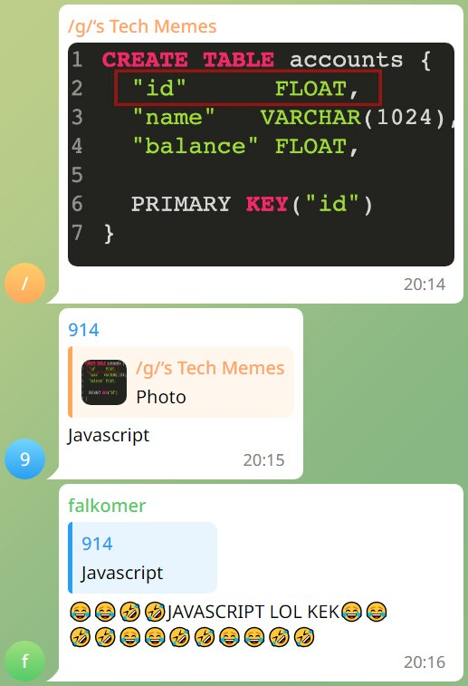
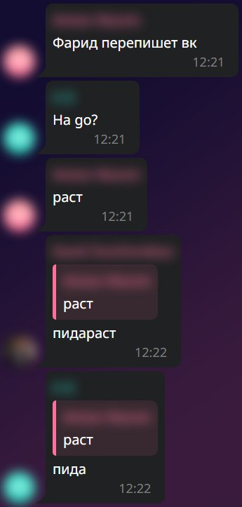

# SimpleQuoteBot

A simple TG quote bot for generating quote screenshots from forwarded to private chat messages.

## Features:

- Authentic rendering messages
  - text
  - images
  - stickers
  - rest in WIP
- Themes
- Anonymous mode
- Docker support (currently broken)

### Limitations:

1. No avatars for private profiles

## Usage

1. Forward messages to private chat with bot.
2. Reply `/q <params>` command on first message.
3. ???
4. Profit!

### Params
- `dark` - dark theme;
- `anon` - hide avatars and names.

### Examples

`/q`

`/q dark anon`

## Develop

### Requirements:

- Chrome
- Python 3
- pip
- black
- env `BOT_TOKEN` - telegram bot token from Bot Father

### Or work with docker

1. Rename `.env.example` to `.env`
2. Put values to this file
3. Run `docker compose up -d`

## License
Project licensed under [MIT License](/LICENSES/LICENSE).

For third party elements see [LICENSES](/LICENSES)
