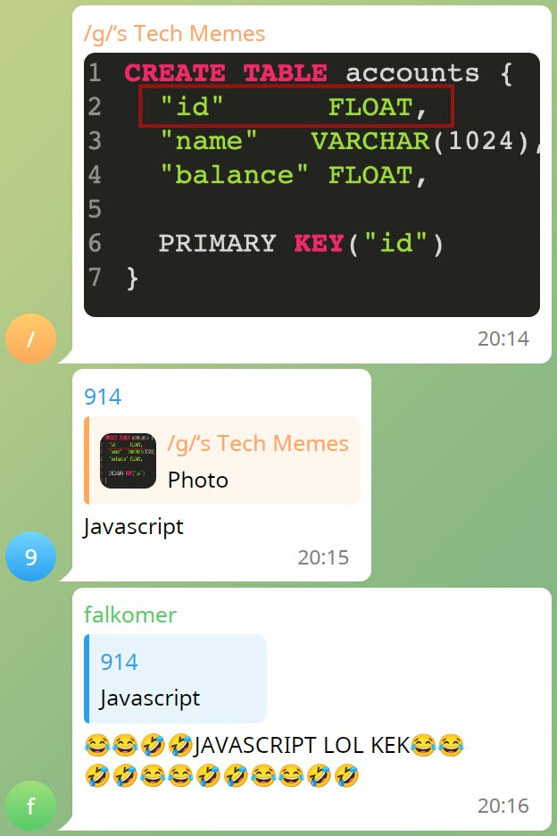

# SimpleQuoteBot

A simple TG quote bot for generating quote screenshots from forwarded to private chat messages.

## Current limitations:

1. No avatars (for some reason)
2. No data about hidden users (obv)
3. Only text messages (rest is in TODO)

## Usage

1. Forward messages to private chat with bot.
2. Reply `/q <params>` command on first message.
3. ???
4. Profit!

### Params
- `dark` - dark theme;
- `anon` - hide avatars and names.

### Examples

`/q`

`/q dark anon`

## License
Project licensed under [MIT License](/LICENSES/LICENSE).

For third party elements see [LICENSES](/LICENSES)
